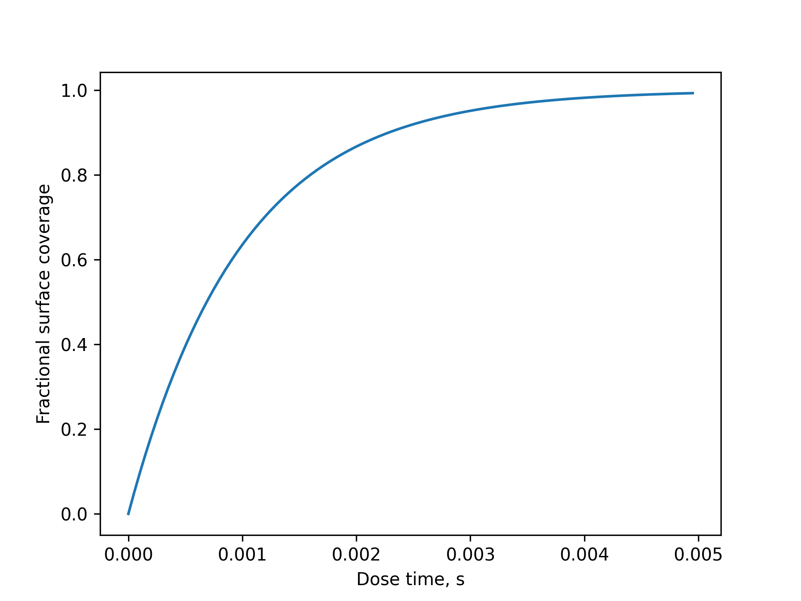
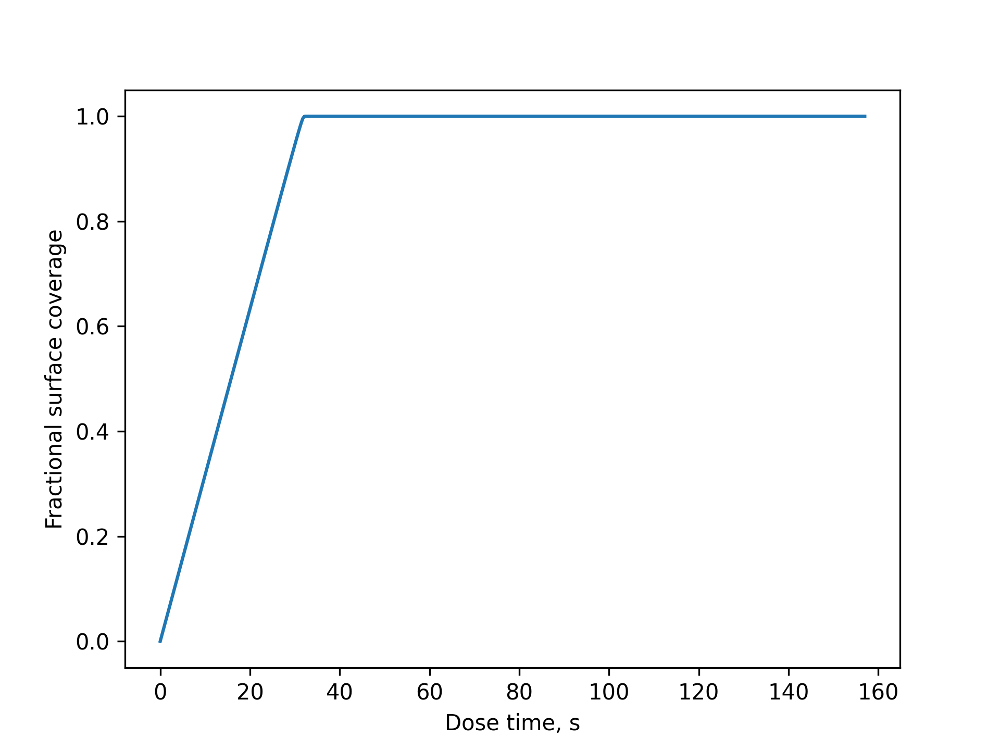
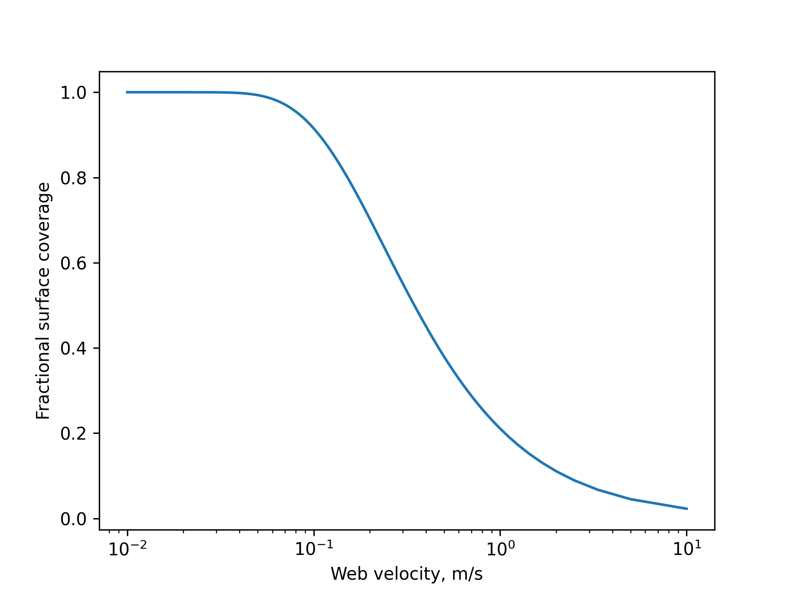
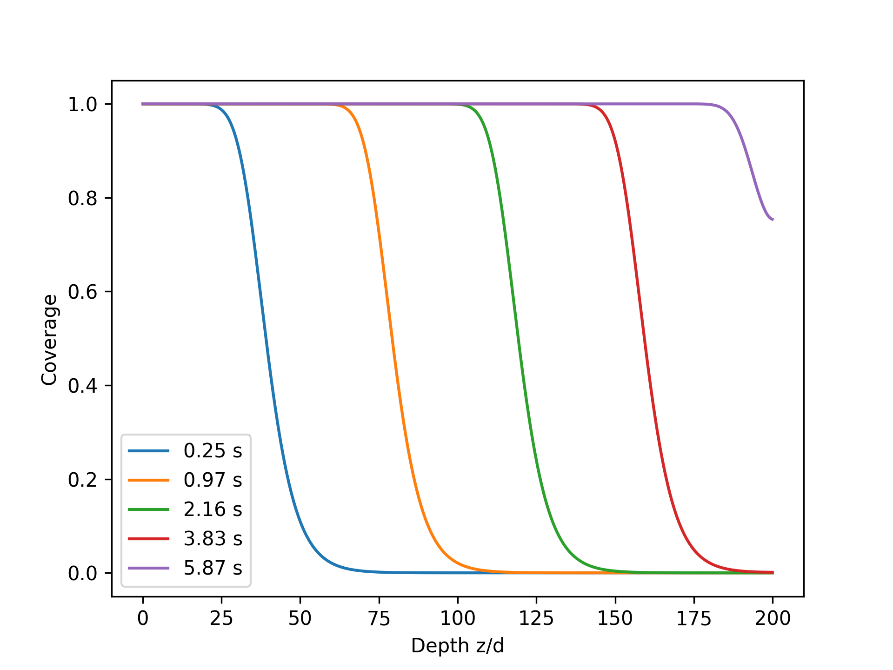

======================
Single exposure models
======================

Single exposure models focus on the evolution of surface coverage with time under
different experimental conditions. Here is a list of currently implemented and
in development models. They are all based on models published in the literature.

0D constant partial pressure model
----------------------------------

The ``ZeroD`` model implements the simplest possible case in ALD: the evolution of
surface coverage as a function of exposure for a constant partial pressure pulse:

.. code-block:: python

    from aldsim import Precursor, ALDchem
    from aldsim.models import ZeroD
    import matplotlib.pyplot as pt

    # Define a precursor (TMA with molecular mass in g/mol)
    tma = Precursor('TMA', mass=144.17)

    # Define surface kinetics with ideal Langmuir behavior
    kinetics = ALDchem(prec=tma, nsites=1e19, p_stick1=0.01)

    # Create the ZeroD model at 200°C and 100 Pa
    model = ZeroD(chem=kinetics, T=473.15, p=100)

    # Generate the saturation curve
    time, coverage = model.saturation_curve()

    # Plot the saturation curve
    pt.plot(time, coverage)
    pt.xlabel("Dose time, s")
    pt.ylabel("Fractional surface coverage")
    pt.show()

   Saturation curve for the ZeroD model.

ALD of particles in fluidized bed reactors
------------------------------------------

.. note::

   The ``FluidizedBed``  model is currently implemented
   for ALD surface kinetics with a single reaction pathway only. Use ``ALDchem``
   for the surface chemistry definition.

The model for ALD in a fluidized bed reactor is directly implemented from the works:

* `Scalable synthesis of supported catalysts using fluidized bed atomic layer
  deposition <https://doi.org/10.1116/6.0001891>`_

* `Modeling scale-up of particle coating by atomic layer deposition
  <https://doi.org/10.1116/6.0004006>`_. A preprint is available in `arXiv <https://arxiv.org/abs/2408.13116>`_

This model considers a perfectly mixed column of particles and a plug flow model for precursor
transport across the column:

.. code-block:: python

    from aldsim import Precursor, ALDchem
    from aldsim.models import FluidizedBed
    import matplotlib.pyplot as pt

    # Define precursor and surface chemistry
    tma = Precursor('TMA', mass=144.17)
    chem = ALDchem(tma, nsites=1e19, p_stick1=1e-3)

    # Create the FluidizedBed model
    # p: precursor partial pressure (Pa), p0: carrier gas pressure (Pa)
    # T: temperature (K), S: total particle surface area (m²), flow: gas flow (sccm)
    model = FluidizedBed(chem, p=13.2, p0=100, T=500, S=10, flow=60)

    # Generate the saturation curve
    time, coverage = model.saturation_curve()

    # Plot the saturation curve
    pt.plot(time, coverage)
    pt.xlabel("Dose time, s")
    pt.ylabel("Fractional surface coverage")
    pt.show()

   Saturation curve for the FluidizedBed model.

.. todo::

   Add support for soft saturating ALD processes.

.. todo::

   Add support for plasma based processes.

ALD of particles in a rotating drum reactor
-------------------------------------------

.. note::

   The ``RotatingDrum``  model is currently implemented
   for ALD surface kinetics with a single reaction pathway only. Use ``ALDchem``
   for the surface chemistry definition.

Model for particle coating on a well-stirred environment as described in:

* `Analytic expressions for atomic layer deposition: Coverage, throughput, and materials
  utilization in cross-flow, particle coating, and spatial atomic layer deposition <https://doi.org/10.1116/1.4867441>`_

* `Modeling scale-up of particle coating by atomic layer deposition
  <https://doi.org/10.1116/6.0004006>`_. A preprint is available in `arXiv <https://arxiv.org/abs/2408.13116>`_

This model considers a perfectly stirred reactor model for particle coating using ALD:

.. code-block:: python

   from aldsim import Precursor, ALDchem
   from aldsim.models import RotatingDrum

   prec = Precursor(mass=150.0)
   nsites = 1e19
   p_stick1 = 1e-3
   chem = ALDchem(prec, nsites, p_stick1)

   # Create the RotatingDrum model
   # p: precursor partial pressure (Pa), p0: carrier gas pressure (Pa)
   # T: temperature (K), S: total particle surface area (m²), flow: gas flow (sccm)
   model = RotatingDrum(chem, p=0.1*1e5/760, p0=1e2, T=500,
                  S=1e1, flow=60)

   t, theta = model.saturation_curve()

   Saturation curve for the RotatingDrum model.

.. todo::

   Add support for soft saturating ALD processes.

Spatial ALD reactor model
-------------------------

.. note::

   The ``SpatialWellMixed`` model is currently implemented
   for ALD surface kinetics with a single reaction pathway only. Use ``ALDchem``
   for the surface chemistry definition.

Model for ALD coating in a spatial reactor using a well-stirred precursor approximation.
This model supports two configurations:

* **Flat surface coating**: When ``S`` is ``None``, the model treats the substrate as
  a flat surface with area L × W (e.g., roll-to-roll coating of flexible substrates).
* **Particle bed coating**: When ``S`` is provided, it represents the total surface
  area of particles to be coated within the reactor zone. Particles are assumed to be
  well mixed in the directions perpendicular to the movement (i.e. by vibrating bed or other
  agitation methods)

The model is described in the following papers:

* `Analytic expressions for atomic layer deposition: Coverage, throughput, and materials
  utilization in cross-flow, particle coating, and spatial atomic layer deposition <https://doi.org/10.1116/1.4867441>`_

* `Modeling scale-up of particle coating by atomic layer deposition
  <https://doi.org/10.1116/6.0004006>`_. A preprint is available in `arXiv <https://arxiv.org/abs/2408.13116>`_

The saturation curve is expressed as a function of web/substrate velocity:

.. code-block:: python

   from aldsim import Precursor, ALDchem
   from aldsim.models import SpatialWellMixed
   import matplotlib.pyplot as pt

   # Define precursor and surface chemistry
   prec = Precursor(mass=150.0)
   chem = ALDchem(prec, nsites=1e19, p_stick1=1e-3)

   # Create the SpatialWellMixed model for flat surface coating
   # p: precursor partial pressure (Pa), p0: carrier gas pressure (Pa)
   # T: temperature (K), flow: gas flow (sccm)
   # L: zone length (m), W: zone width (m)
   model = SpatialWellMixed(chem, p=13.2, p0=100, T=500,
                            flow=60, L=0.02, W=0.1)

   # Generate saturation curve as function of web velocity
   u, theta, x = model.run(umax=10)

   # Plot the saturation curve
   pt.semilogx(u, theta)
   pt.xlabel("Web velocity, m/s")
   pt.ylabel("Fractional surface coverage")
   pt.show()

   Saturation curve for the SpatialWellMixed model showing coverage vs web velocity.

ALD in high aspect ratio vias
-----------------------------

.. note::

   The ``KnudsenVia`` model is currently implemented
   for ALD surface kinetics with a single reaction pathway only. Use ``ALDchem``
   for the surface chemistry definition.

Model for ALD coating inside high aspect ratio circular vias using Knudsen
diffusion transport. The model solves the coupled diffusion-reaction equations
to predict coverage profiles along the via depth as a function of exposure time.

.. code-block:: python

    from aldsim import Precursor, ALDchem
    from aldsim.models import KnudsenVia
    import matplotlib.pyplot as pt

    # Define a precursor (TMA with molecular mass in g/mol)
    tma = Precursor('TMA', mass=144.17)

    # Define surface kinetics with ideal Langmuir behavior
    kinetics = ALDchem(prec=tma, nsites=1e19, p_stick1=0.01)

    # Create the KnudsenVia model at 200°C, 10 Pa, and aspect ratio 200
    model = KnudsenVia(chem=kinetics, T=473.15, p=10, AR=200)

    # Generate the saturation curve
    time, z, coverage = model.saturation_curve()

    # Plot coverage profiles at different times
    for t, c in zip(time, coverage):
        pt.plot(z, c, label=("%4.2f s" % t))

    pt.xlabel("Depth z/d")
    pt.ylabel("Coverage")
    pt.legend()
    pt.show()

   Saturation profiles as a function of normalized depth (z/diameter) for increasing dose times